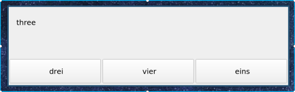

# vocabBuilder

A simple, annoying, program to help increase vocabulary in a foreign language. The program runs in the background, pops up after a set number of minutes and asks you a series of questions. Once all questions have been answered, the program hides in the background, ready to annoy you later.



# Installation

So far this has only been tested on Arch Linux using I3WM and Windows 10. Although, I can't see why it wouldn't work on other Linux / Windows distros. The program is boxed using [PyInstaller](https://www.pyinstaller.org/).

Get the binary directly with:

(Linux)
```
wget https://github.com/stuianna/vocabBuilder/releases/download/v0.1.0/vocabBuilder
```

(Windows)
```
wget https://github.com/stuianna/vocabBuilder/releases/download/v0.1.0/vocabBuilder.exe
```

Or clone this directory and run it directly with a Python interpreter (requires Python 3 and PyQt5).

# Usage

The words and translations are stored in a CSV file, like this:

```
one, eins
two, zwei
police, Polizei
three, drei
four, vier
grenadier, Grenadier
```

Assuming you're in the installed directory, the program is then started from the command line / terminal like so:

(Linux)
```
 vocabBuilder words.csv
```

(Windows)
```
 .\vocabBuilder \.words.csv
```

By default, it asks 5 questions every 10 minutes, this can be changed using the options -t and -q:
```
vocabBuilder words.csv -q 10 -t 20
```

# Adding Words

If you have [Translate-shell](https://github.com/soimort/translate-shell) available, a little script like this
can make adding words easy.

```
#!/bin/bash

#FILE: tll -> Add translated words to database

TRANSLATION="$(trans en:lv -b $1)"
echo "${1}, ${TRANSLATION}" >> /path/to/word/directory/current.csv
```
Use trans -R to get the the desired language codes from translate-shell and change the path.

Chuck it somewhere so it's available on path, then use it like:
```
tll hippo
```
This will append the new word to the end of the file.
```
hippo, nīlzirgs
```
The new word is included in the test set once all words in the existing set have been used.
