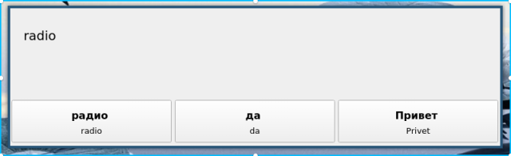

# vocabBuilder

A simple, annoying, program to help increase vocabulary in a foreign language. The program runs in the background, pops up after a set number of minutes and asks you a series of questions. Once all questions have been answered, the program hides in the background, ready to annoy you later.



The program, when started, includes a system tray icon. This can be used to pause or exit the background program.

Table of Contents
=================

   * [vocabBuilder](#vocabbuilder)
   * [Installation](#installation)
   * [Usage](#usage)
      * [Word Dictionary](#word-dictionary)
      * [Graphical User Interface](#graphical-user-interface)
      * [Command Line Interface](#command-line-interface)
   * [Adding Words](#adding-words)
   * [Development](#development)
      * [Building](#building)
      * [TODO](#todo)

# Installation

So far this has only been tested on Arch Linux using I3WM and Windows 10. Although, I can't see why it wouldn't work on other Linux / Windows distros. The program is boxed using [PyInstaller](https://www.pyinstaller.org/).

Get the binary directly with either:

1. Downloading directly from the *release* page.

-- or --

2. Using wget:

(Linux - GUI)
```
wget https://github.com/stuianna/vocabBuilder/releases/download/v0.2.0/vocabBuilder
```

(Linux - CLI)
```
wget https://github.com/stuianna/vocabBuilder/releases/download/v0.2.0/vocabBuilder-cli
```

(Windows - GUI)
```
wget https://github.com/stuianna/vocabBuilder/releases/download/v0.2.0/vocabBuilder.exe
```
-- or --

3: Clone this directory and run it directly with a Python interpreter (requires Python 3 and PyQt5).

# Usage

The program is built with either a graphical user or command line interface.

## Word Dictionary

The words and translations are stored in a CSV file, like this:

```
one, eins
two, zwei
police, Polizei
three, drei
four, vier
grenadier, Grenadier
```
## Graphical User Interface

The graphical interface consists of a simple main menu in which the basic options and word dictionary can be selected before the tests are run.


## Command Line Interface

Assuming you're in the installed directory, the program is then started from the command line / terminal like so:

(Linux)
```
 vocabBuilder words.csv
```

(Windows)
```
 .\vocabBuilder \.words.csv
```

By default, it asks 5 questions every 10 minutes, this can be changed using the options -t and -q:
```
vocabBuilder words.csv -q 10 -t 20
```
# Adding Words

If you have [Translate-shell](https://github.com/soimort/translate-shell) available, a little script like this
can make adding words easy.

```
#!/bin/bash

#FILE: tll -> Add translated words to database

TRANSLATION="$(trans en:lv -b $1)"
echo "${1}, ${TRANSLATION}" >> /path/to/word/directory/current.csv
```
Use trans -R to get the the desired language codes from translate-shell and change the path.

Chuck it somewhere so it's available on path, then use it like:
```
tll hippo
```
This will append the new word to the end of the file.
```
hippo, nīlzirgs
```
The new word is included in the test set once all words in the existing set have been used.

# Development

Development requires Python3 and PyQt5, binaries are packed with pyInstaller.

## Building

When building for each platform, make sure the correct option is set in *volcabBuilder.py*. (~ line 31)
```
# Progam type CLI/GUI
mode = 'CLI'
```

Make a .spec file for the project:

```
pyi-makespec vocabBuilder.py
```

Change
```
datas=[],
```
to
```
datas=[('resources/bbp.png','resources')],
```


To build the CLI on Linux:

```
pyinstaller vocabBuilder.spec --onefile -n vocabBuilder-cli
```

To build the GUI on Linux

```
pyinstaller vocabBuilder.spec --onefile -n vocabBuilder
```

To build the GUI on Windows

```
pyinstaller .\vocabBuilder.spec --onefile --noconsole -n vocabBuilder
```

## TODO

1. Incorporate 'stats' which keeps record of the total correct, total attempts and number of tests. This could be saved with QSettings into the local config directory for later GUI/CLI implementation.
2. Add a taskbar option to go back to the main menu (for the GUI), this way the test settings can be modified.
